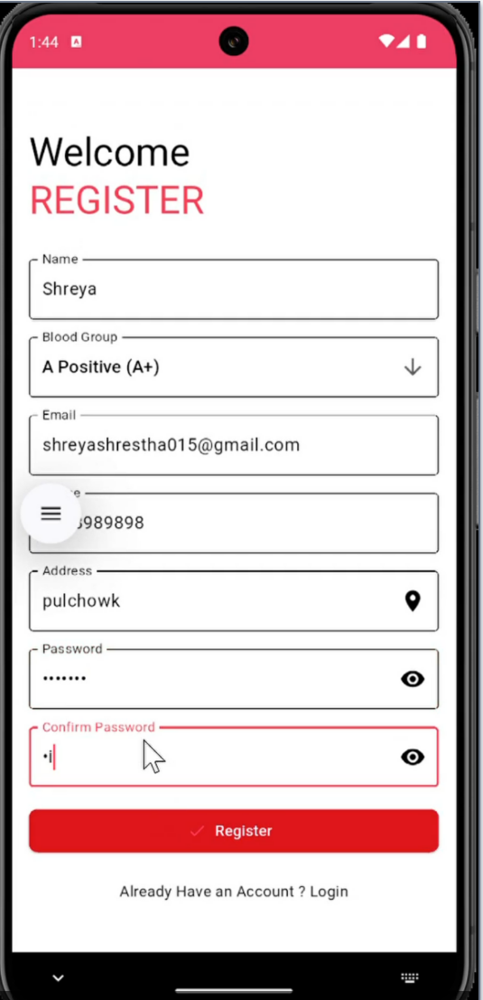
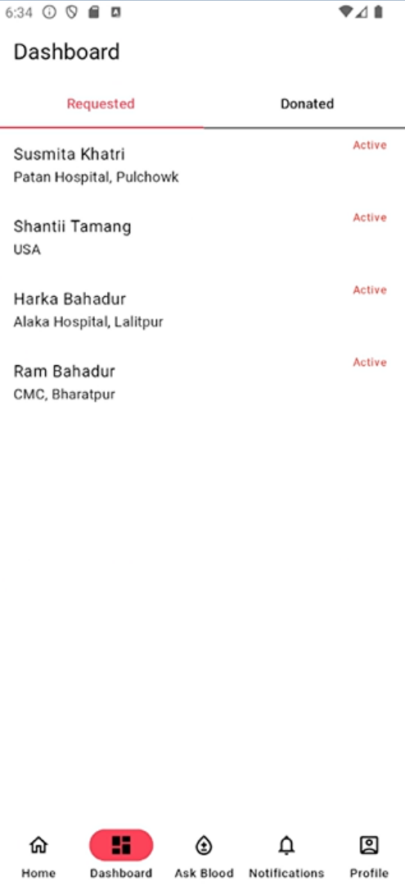
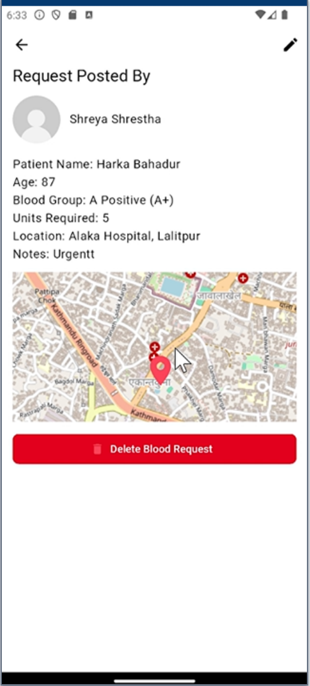
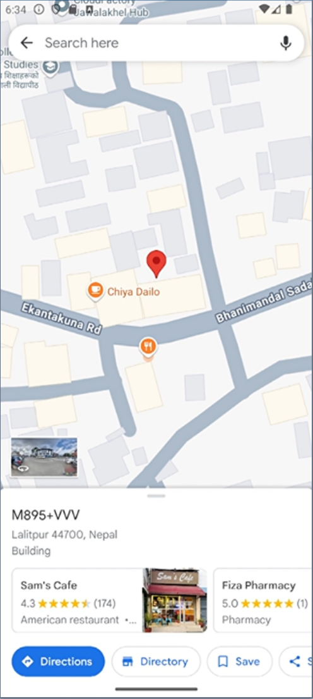
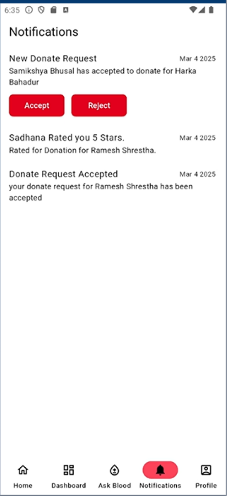

# 🩸 Blood Donation System

A full-stack application that simplifies and improves the blood donation process by securely connecting donors and recipients using geolocation, real-time notifications, and role-based access. Built with Flutter, Express.js, MongoDB, and Firebase.

---

## 📲 Features

- 🔐 **Secure Authentication (JWT)**  
  Manual JWT-based authentication with role-based access for donors and requestors.

- 📍 **Geolocation-Based Matching**  
  Notifies eligible donors within a 200 km radius using GPS.

- 🔔 **Real-Time Notifications**  
  Firebase Cloud Messaging (FCM) integration for immediate alerts.

- 🗺️ **OpenStreetMap Integration**  
  Displays nearby donors/campaigns via `flutter_map`.

- 📱 **Mobile-First Design with Flutter**  
  Intuitive dashboards for donor and recipient with clean UI.

- 📊 **Donation Tracking**  
  Request history, donor rating, and profile management.

---

## 🧰 Tech Stack

| Layer           | Technologies                      |
|------------------|----------------------------------|
| Frontend         | Flutter, Dart                    |
| Backend/API      | Node.js, Express.js              |
| Authentication   | JSON Web Token (JWT)             |
| Database         | MongoDB (NoSQL)                  |
| Notifications    | Firebase Cloud Messaging (FCM)   |
| Maps             | OpenStreetMap                    |

---

## 🔍 Screenshots

### Login & Registration

### Donor Dashboard

### Request Blood Flow

### Map Integration

### Notification

